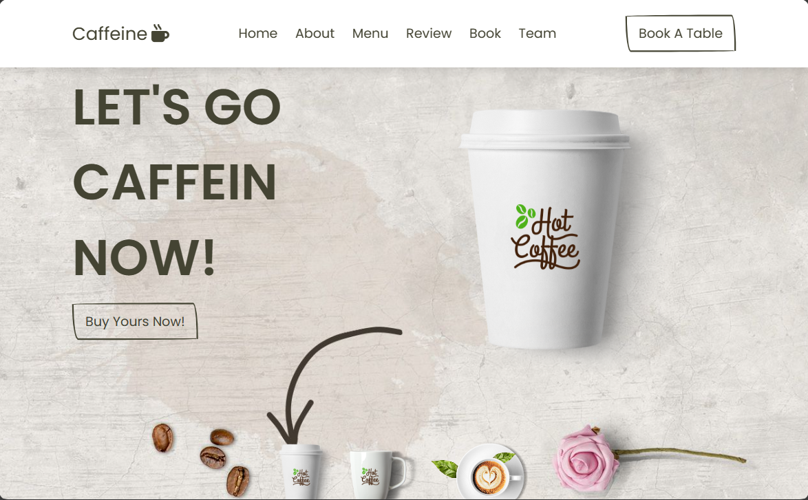

# CAFFEINE - LET'S GO CAFFEIN NOW!

## About

Caffeine is a coffee shop that sells coffee made from selected Indonesian coffee beans which have a unique Indonesian coffee taste.

## Key Features

- Online Booking: Makes it easier for users to make online bookings.
- About : Information about caffeine
- Review: Explore firsthand experiences by accessing reviews from individuals who have previously visited our platform..

## Technologies Used

- **HTML, CSS, JavaScript (JS):** Front-end technologies for building the user interface and enhancing user experience.
- **MySQL:** Database for storing and managing data.
- **Railway:** A platform for deploying and managing databases and backend services easily.

---

© Copyright Year Group N-27 RevoU. All Rights Reserved.
